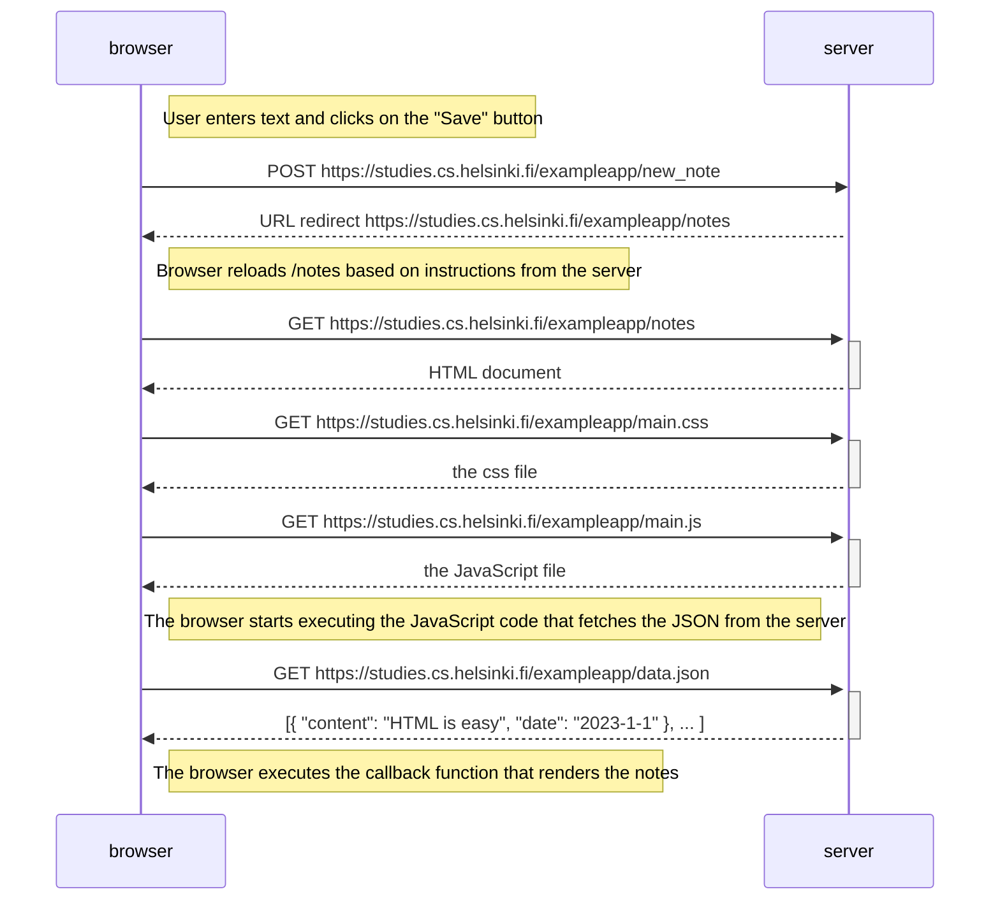
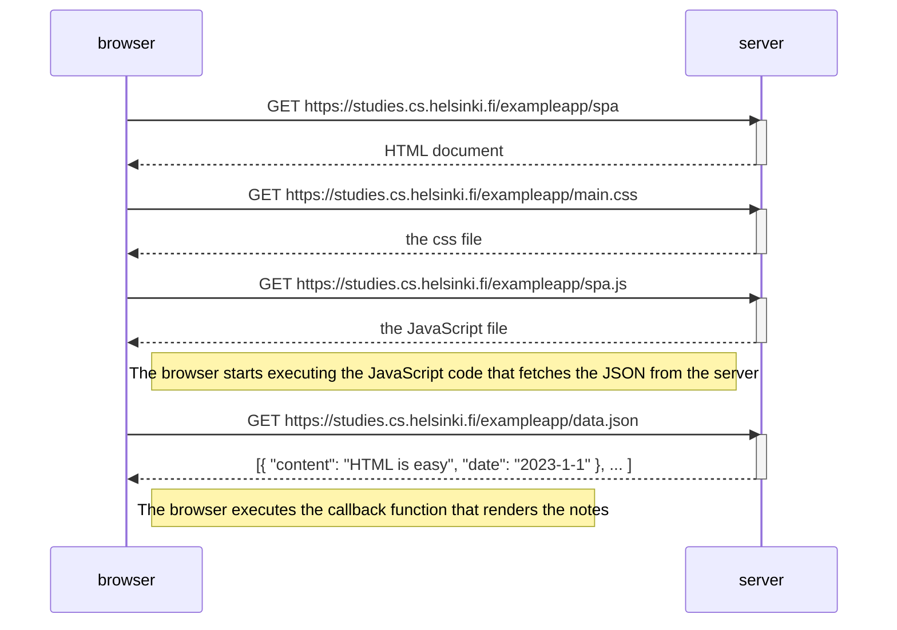
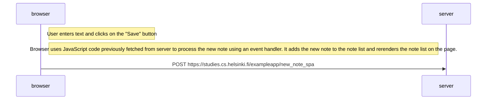

## Exercise 0.4: New note diagram

## Exercise 0.5: Single page app diagram

Create a diagram depicting the situation where the user goes to the single-page app version of the notes app at https://studies.cs.helsinki.fi/exampleapp/spa.

## Exercise 0.6: New note in Single page app diagram

Create a diagram depicting the situation where the user creates a new note using the single-page version of the app.

